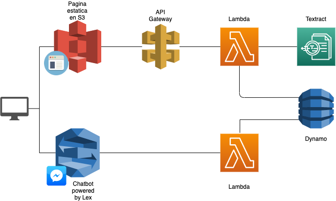

# Proyecto SS1
El proyecto consiste en dos partes:
1. Una [pagina web](https://ss1-201713894.s3.us-east-2.amazonaws.com/index.html) donde se cargan fotos de los formularios. 

2. Un asistente inteligente, un [chatbot](https://m.me/101618325099699) en la interfaz de Facebook Messenger, al que se le puede solicitar informacion cargada en los formularios.

## Demo
Una demostracion del funcionamiento del sistema puede ser vista en este [video](https://youtu.be/oqVJKoDJ6xQ)

## Arquitectura Final

## Limitaciones y siguientes Pasos

1. El chatbot no fue aprobado por Facebook y por lo tanto no funciona para el publico en general; solo para aquellos que estan registrados como desarrolladores o testers de la aplicacion.
2. El sistema no tiene autenticacion; la idea original era utilizar un servicio de reconocimiento por voz pero ciertas restricciones con el tipo de archivo de audio no permitieron el avance.
3. El asistente inteligente estaba planeado originalmente para comunicarse por voz, y mientras el bot implementado en AWS Lex si tiene funciones de voz, la interfaz grafica para implementar grabaciones de audio resulto en complicaciones no planeadas.