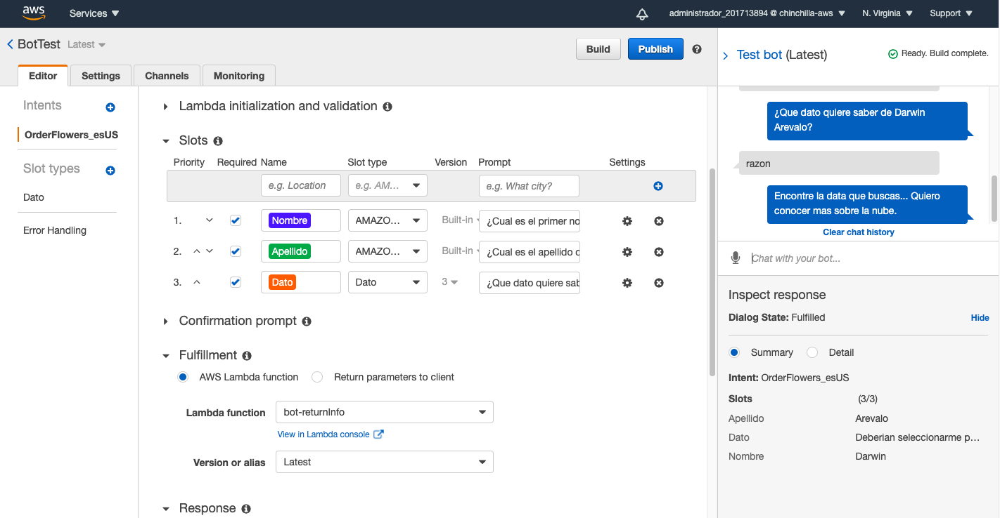

# AWS Lex

Nuestro bot tiene un unico intent que se vale de tres slots
1. Nombre
2. Apellido
3. Dato

Una vez obtiene estos datos envia la informacion a una funcion Lambda para su posterior procesamiento.

